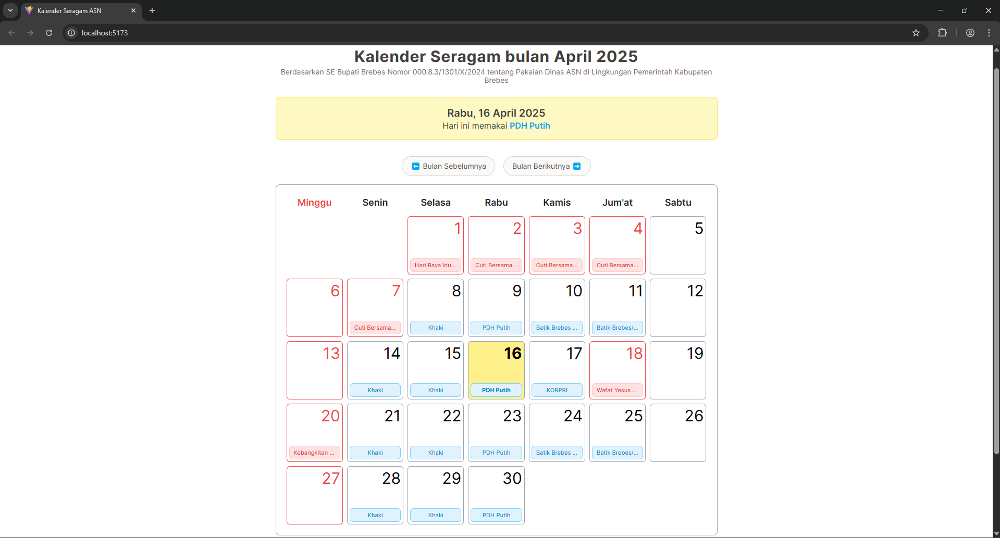

# 📅 Kalender Seragam

**Kalender Seragam** adalah aplikasi berbasis web yang membantu mengatur jadwal pemakaian seragam berdasarkan hari dalam seminggu. Cocok digunakan untuk sekolah, kantor, atau organisasi yang memiliki aturan seragam berbeda setiap hari. Aplikasi ini juga secara otomatis menyesuaikan jadwal dengan hari libur nasional di Indonesia.


## ✨ Fitur Utama

- Menampilkan kalender bulanan dengan jadwal seragam tiap hari.
- Penanda khusus untuk hari libur nasional.
- Menggunakan API publik untuk data hari libur nasional Indonesia.


## 🛠 Teknologi yang Digunakan

- [React.js](https://reactjs.org/)
- [Tailwind CSS](https://tailwindcss.com/)
- [DayOff API](https://dayoffapi.vercel.app/) – untuk mendapatkan data hari libur nasional.


## 🚀 Cara Menjalankan Proyek

1. **Clone repositori ini**
   ```bash
   git clone https://github.com/madep-dev/kalender-seragam.git
   cd kalender-seragam
2. **Install dependensi**
   ```bash
   npm install
3. **Jalankan aplikasi secara lokal**
   ```bash
   npm run dev
4. Akses aplikasi melalui browser di http://localhost:5173 (atau port yang ditampilkan).


## 🌐 Live Demo 
[kalender-seragam.vercel.app](https://kalender-seragam.vercel.app/)


## 📅 Sumber Data Hari Libur

Data hari libur nasional diambil dari DayOff API, yang menyediakan informasi libur resmi di Indonesia.


## 📷 Cuplikan Layar




## 📄 Lisensi

Proyek ini dilisensikan di bawah lisensi MIT.

Terima kasih sudah mampir ke repositori ini! 😊
